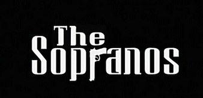
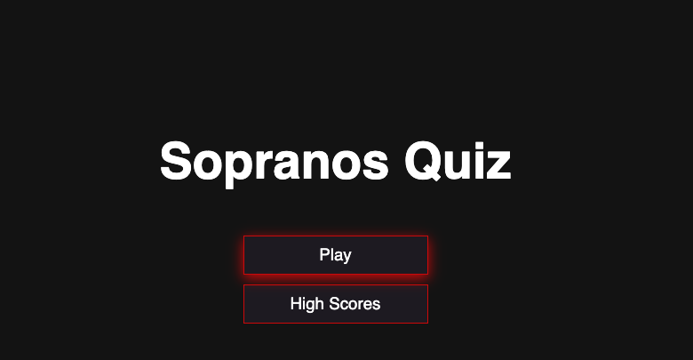
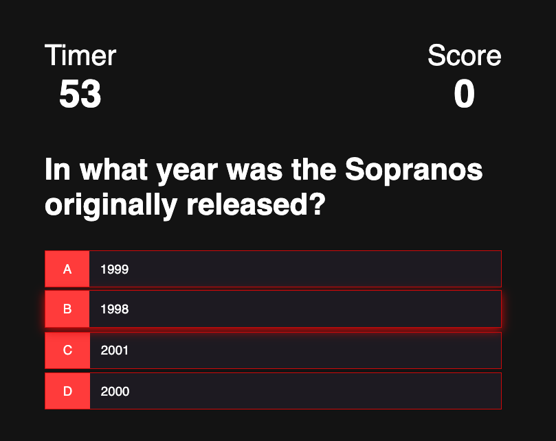
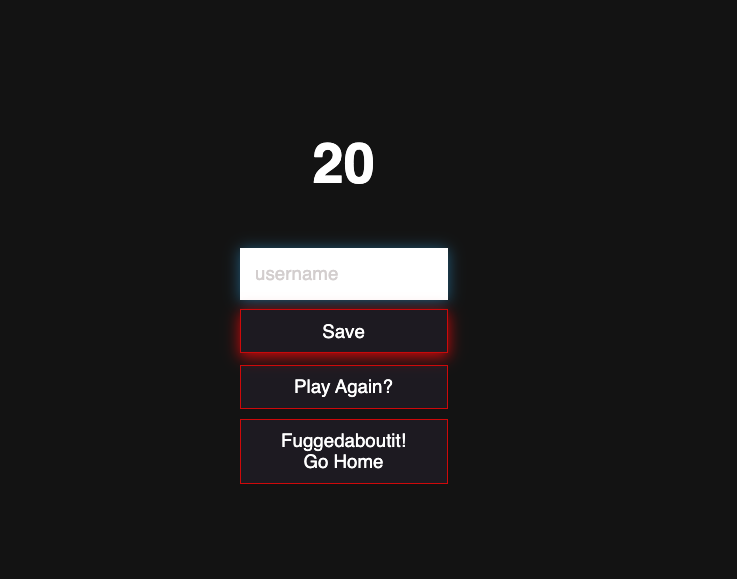

# Soprano Quiz

## Deployed App
https://adamwjones.github.io/Quiz/index.html

## Watch video here
https://youtu.be/3wH_BVAieoA

## Description
As someone who lives just down the street from where the final episode of the Sopranos was filmed (at Holstens http://holstens.com/sopranos/), I thought it would be fun to create a Sopranos themed quiz for this project. 

The if the user gets a high score, then they can save their score and be recognized as a don. If not, then Fuggedaboutit and play again!

## Table of Contents

- [Description](#description)
- [Installation](#installation)
- [Usage](#usage)
- [Contribution](#contribution)
- [Test](#test)
- [License](#license)
- [Questions](#questions) 
- [Screenshots](#screenshots)

### Installation
Please follow these unique installation instructions (if necessary): No installations are required as this is a purely frontend browser based app 

### Usage
This application’s code is free to use following the terms of the license identified. Additional usage instructions are: Same as license 

### Contribution
This applicating was made by Adam Jones 

### Test 
I would not trust my code (or any code) without testing it myself. Please consider performing the following testing on this application prior to use: Take a look to validate that it worked before blindly pushing it to GitHub

### License               
This application is covered under the terms of the Artistic License 2.0 
Pease refer to their site for more details of the terms of use permittable.

### Questions

* If you have any questions or comments regarding this project, please contact me at adam.w.jones2@gmail.com and I will try to reply as soon as possible. 

* If you liked this project, please check out my GitHub page at adamwjones to see more of my work.

### Screenshots

* Sopranos logo

* Start the quiz! 

* Answer the questions 

* Save your score 

